# Compose

<p align="left">
  
</p>

151 self-hosted Docker Compose stacks — ready-to-deploy configurations for the best open-source tools and services.

---

## 🧠 AI & LLM

| Logo | Project | Description | Port |
|------|---------|-------------|------|
|  | [anythingllm](./anythingllm/) | All-in-one AI app for document chat, RAG, and agents with any LLM | 3001 |
|  | [blinko](./blinko/) | Self-hosted bookmark and knowledge management tool with AI-powered organization | 1111 |
|  | [bolt.diy](./bolt.diy/) | Open-source AI coding assistant in the browser | 5173 |
|  | [crawl4ai](./crawl4ai/) | Open-source LLM-friendly web crawler and scraper with AI-powered data extraction | 11235 |
| 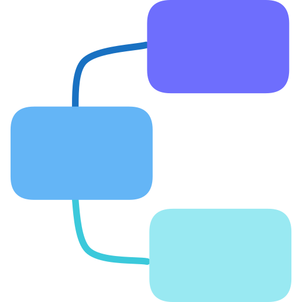 | [flowise](./flowise/) | Drag-and-drop LLM flow builder for building AI agents and chatbots | 3000 |
|  | [ibm-mcp-context-forge](./ibm-mcp-context-forge/) | MCP gateway and management platform for organizing, sharing, and securing MCP servers | 4444 |
|  | [langflow](./langflow/) | Low-code visual framework for building multi-agent and RAG applications with LangChain | 7860 |
|  | [langfuse](./langfuse/) | Open-source LLM observability, tracing, and evaluation platform | 3000 |
|  | [litellm](./litellm/) | Proxy server to call 100+ LLM APIs in OpenAI format with load balancing, spend tracking, and fallbacks | 4000 |
|  | [marimo](./marimo/) | Reactive Python notebooks — reproducible, Git-friendly, and app-ready | 2718 |
| 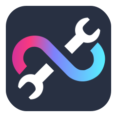 | [metamcp](./metamcp/) | Unified middleware proxy that connects multiple MCP tools to any LLM client | 12008 |
|  | [openhands](./openhands/) | AI-powered software development agent platform | 3000 |
|  | [openwebui](./openwebui/) | User-friendly LLM web interface with RAG, tools, and multi-user support | 8080 |
|  | [zeroclaw](./zeroclaw/) | Fast, small, and fully autonomous AI personal assistant infrastructure 🦀 | 42617 |

## 🔧 API & Gateway

| Logo | Project | Description | Port |
|------|---------|-------------|------|
|  | [apisix](./apisix/) | High-performance cloud-native API gateway with dynamic routing, plugin system, and dashboard | 9180 |
|  | [azimutt](./azimutt/) | Full-stack database exploration tool with ERD, data navigation, and documentation | 4000 |
| 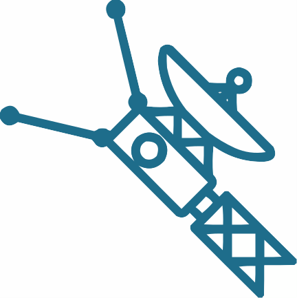 | [graphql-voyager](./graphql-voyager/) | Interactive GraphQL schema visualization as a graph | 80 |
|  | [hoppscotch](./hoppscotch/) | Open-source API development ecosystem — alternative to Postman and Insomnia | 80 |
|  | [kong](./kong/) | Cloud-native API gateway with plugin ecosystem for authentication, rate limiting, and transformations | 8002 |
|  | [nango](./nango/) | Unified API integration platform for handling 250+ third-party API OAuth connections | 3003 |
|  | [nginx-proxy-manager](./nginx-proxy-manager/) | Easy-to-use reverse proxy with SSL management and web UI | 81 |

## ⚡ Automation & CI/CD

| Logo | Project | Description | Port |
|------|---------|-------------|------|
| 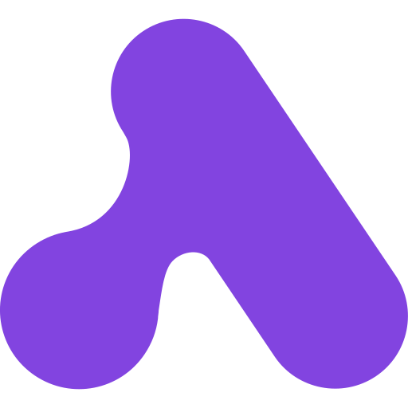 | [activepieces](./activepieces/) | Open-source AI automation tool with 200+ integrations — Zapier alternative | 80 |
|  | [apprise-api](./apprise-api/) | Lightweight REST framework wrapping the Apprise notification library | 8000 |
|  | [cronicle](./cronicle/) | Distributed task scheduler and job runner with a web-based UI | 3012 |
| 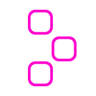 | [dependency-track](./dependency-track/) | Component analysis platform for software supply chain security | 8080 |
|  | [drone](./drone/) | Self-hosted continuous integration and delivery platform powered by containers | 80 |
|  | [flipt](./flipt/) | Feature flag and experimentation platform for modern development teams | 8080 |
|  | [gocd](./gocd/) | Open-source continuous delivery server with modeling and visualization | 8153 |
|  | [harness](./harness/) | Open-source Git platform with built-in CI/CD pipelines, code reviews, and container registry | 3000 |
|  | [jenkins](./jenkins/) | Leading open-source automation server with 2000+ plugins | 8080 |
| 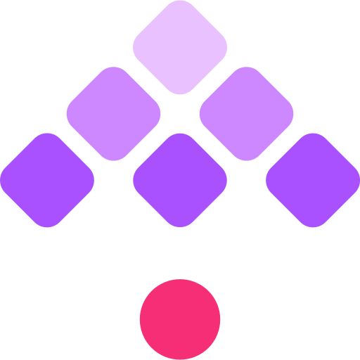 | [kestra](./kestra/) | Workflow automation platform — orchestrate and schedule code in any language | 8080 |
|  | [mageai](./mageai/) | Open-source data pipeline tool for transforming and integrating data with a visual editor | 6789 |
| 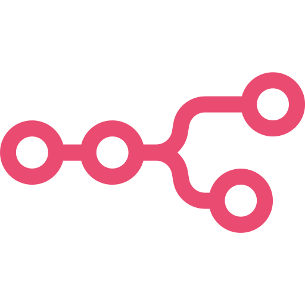 | [n8n](./n8n/) | Fair-code workflow automation with 400+ integrations | 5678 |
|  | [onedev](./onedev/) | All-in-one DevOps platform with Git management, CI/CD, and issue tracking | 6610 |
| 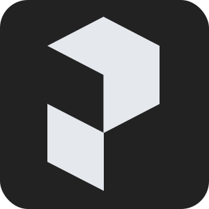 | [prefect](./prefect/) | Modern workflow orchestration platform for building, running, and monitoring data pipelines | 4200 |
| 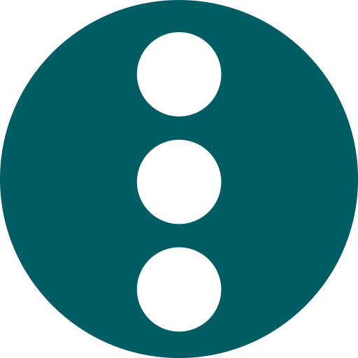 | [semaphore-ui](./semaphore-ui/) | Open-source UI for Ansible, Terraform, and Bash task automation | 3000 |
|  | [windmill](./windmill/) | Open-source developer platform to turn scripts into workflows, UIs, and APIs | 8000 |
| 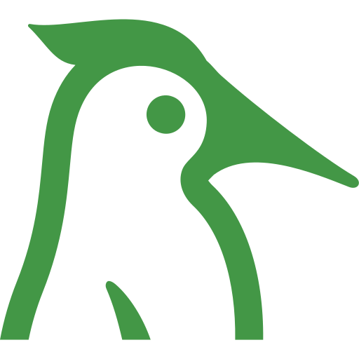 | [woodpecker](./woodpecker/) | Simple and powerful CI/CD engine with minimal footprint | 8000 |

## 📝 Content & Publishing

| Logo | Project | Description | Port |
|------|---------|-------------|------|
|  | [affine](./affine/) | Next-gen collaborative knowledge base with blocks, kanban, and whiteboards | 80 |
| 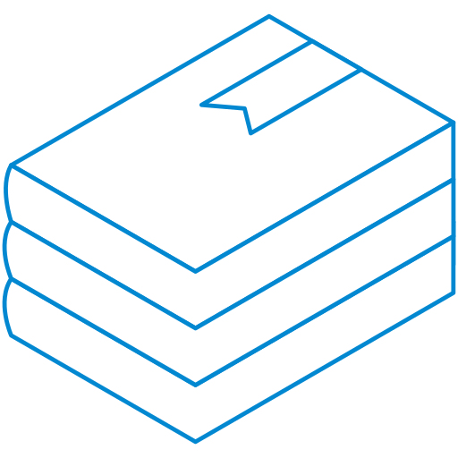 | [bookstack](./bookstack/) | Simple, self-hosted documentation platform built with PHP & Laravel | 80 |
|  | [convertx](./convertx/) | Self-hosted online file converter supporting 1000+ formats | 3000 |
| 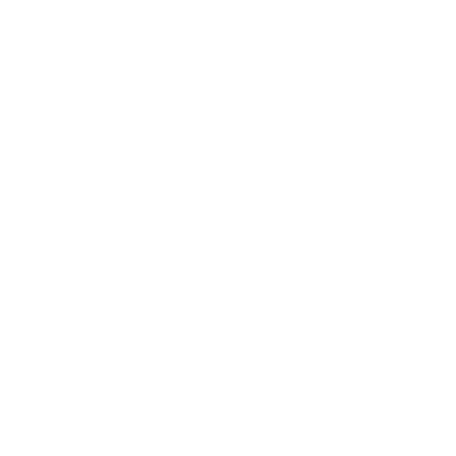 | [directus](./directus/) | Headless CMS with an intuitive admin panel and REST/GraphQL API | 8055 |
|  | [documentso](./documentso/) | Self-hosted documentation platform for teams | 80 |
| 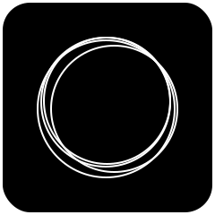 | [ghost](./ghost/) | Independent technology for modern publishing, memberships, subscriptions, and newsletters | 2368 |
|  | [hedgedoc](./hedgedoc/) | Real-time collaborative markdown editor | 3000 |
|  | [homarr](./homarr/) | Customizable browser home page to interact with your Docker containers | 7575 |
| 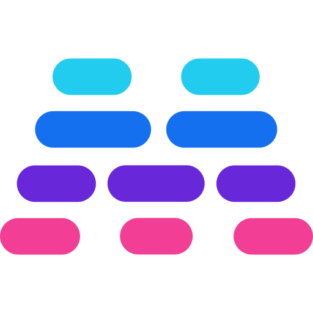 | [maybe](./maybe/) | Open-source personal finance and wealth management app | 3000 |
|  | [nextcloud](./nextcloud/) | Self-hosted cloud collaboration platform for file sync, calendar, and more | 80 |
|  | [obsidian](./obsidian/) | Obsidian LiveSync — self-hosted sync server for Obsidian notes | 5984 |
|  | [paperless-ngx](./paperless-ngx/) | Document management system that transforms physical documents into a searchable online archive | 8000 |
|  | [postiz](./postiz/) | Open-source social media scheduling and management tool | 5000 |
| 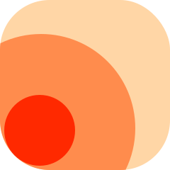 | [rsshub](./rsshub/) | Open-source, extensible RSS feed generator for everything | 1200 |
|  | [siyuan](./siyuan/) | Local-first personal knowledge management system with block-level referencing and WYSIWYG editing | 6806 |
|  | [stirling-pdf](./stirling-pdf/) | Powerful PDF manipulation tool with 50+ operations via web UI | 8080 |
|  | [trilium-next](./trilium-next/) | Next-gen hierarchical note-taking application with scripting and relation maps | 8080 |
|  | [wordpress](./wordpress/) | The world's most popular CMS and website builder | 80 |

## 💻 Development Tools

| Logo | Project | Description | Port |
|------|---------|-------------|------|
| 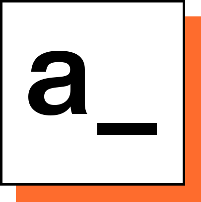 | [appsmith](./appsmith/) | Platform to build admin panels, internal tools, and dashboards | 80 |
|  | [bytebase](./bytebase/) | Database schema change and version control for teams | 80 |
|  | [code-server](./code-server/) | Run VS Code on any machine and access it in the browser | 8443 |
|  | [coder](./coder/) | Self-hosted remote development environments and cloud workspaces powered by code-server | 7080 |
|  | [drawdb](./drawdb/) | Free, simple database diagram editor and SQL generator | 80 |
|  | [drawio](./drawio/) | JavaScript client-side editor for general diagramming | 8080 |
|  | [excalidraw](./excalidraw/) | Virtual collaborative whiteboard for sketching hand-drawn diagrams | 80 |
|  | [filebrowser](./filebrowser/) | Web-based file manager with user management and sharing | 80 |
|  | [it-tools](./it-tools/) | Collection of handy online tools for developers | 80 |
|  | [jupyter-notebook](./jupyter-notebook/) | Web-based notebook environment for interactive computing | 8888 |
|  | [lowcoder](./lowcoder/) | Open-source Retool, Tooljet, and Appsmith alternative | 3000 |
| 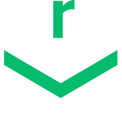 | [nexus](./nexus/) | Repository manager for Maven, npm, Docker, PyPI, and more | 8081 |
| 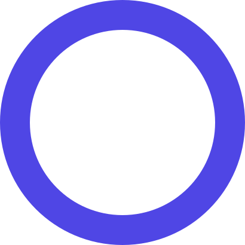 | [omni-tools](./omni-tools/) | Collection of development utilities and tools | 80 |
|  | [opengist](./opengist/) | Self-hosted pastebin powered by Git for code snippets | 6157 |
|  | [page-spy](./page-spy/) | Remote debugging tool for web applications | 6752 |
| 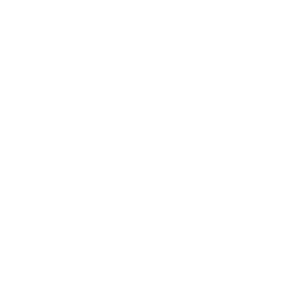 | [penpot](./penpot/) | Open-source design and prototyping platform for teams | 80 |
|  | [pocketbase](./pocketbase/) | Open-source backend with SQLite, auth, file storage, and admin UI | 8090 |
|  | [reposilite](./reposilite/) | Lightweight repository manager for Maven and Gradle artifacts | 8080 |
|  | [sshwifty](./sshwifty/) | Web-based SSH and Telnet client | 8182 |
|  | [whodb](./whodb/) | Lightweight database browser and query editor | 80 |

## 🌐 DNS & Networking

| Logo | Project | Description | Port |
|------|---------|-------------|------|
|  | [cloudflared](./cloudflared/) | Cloudflare Tunnel daemon for proxying traffic from Cloudflare to your origin | N/A |
| 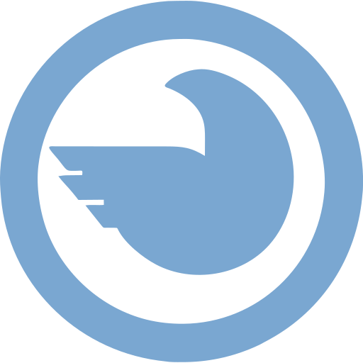 | [ladder](./ladder/) | Self-hosted web proxy to bypass paywalls with custom rule sets | 8080 |
|  | [tailscale](./tailscale/) | Zero-config VPN built on WireGuard | N/A |
|  | [technitium](./technitium/) | Self-hosted DNS server with ad blocking, DNS-over-HTTPS/TLS/QUIC, and DHCP | 5380 |
|  | [wg-easy](./wg-easy/) | Simple WireGuard VPN with web-based management UI | 51821 |

## 📁 File & Media

| Logo | Project | Description | Port |
|------|---------|-------------|------|
|  | [13ft](./13ft/) | Self-hosted 12ft.io clone to bypass paywalls and view articles cleanly | 5000 |
|  | [cloudbeaver](./cloudbeaver/) | Web-based database management tool with rich interface | 8978 |
|  | [duplicati](./duplicati/) | Free backup client for encrypted, compressed, incremental backups to cloud storage | 8200 |
| 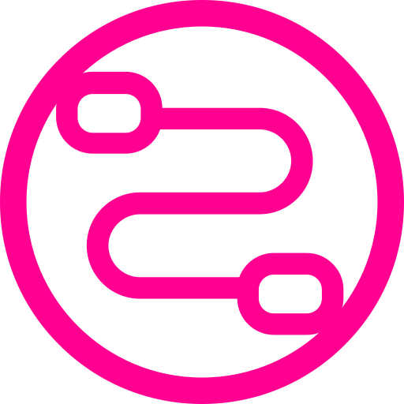 | [fileflows](./fileflows/) | File processing automation with a visual flow editor | 5000 |
|  | [onetimesecret](./onetimesecret/) | Self-hosted secret sharing with single-use links | 3000 |
| 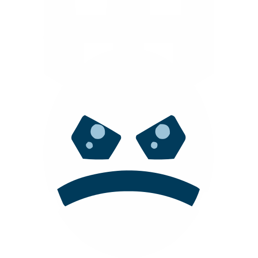 | [pwndrop](./pwndrop/) | Self-hosted file sharing with drag-and-drop and pastebin features | 8080 |
|  | [sftpgo](./sftpgo/) | Fully featured SFTP, FTP/S, and WebDAV server with web admin UI | 8080 |
|  | [transmission](./transmission/) | Fast, easy-to-use BitTorrent client with web interface | 9091 |
|  | [zipline](./zipline/) | Self-hosted file sharing platform with share URLs and management | 3000 |

## 🔐 Identity & Auth

| Logo | Project | Description | Port |
|------|---------|-------------|------|
| 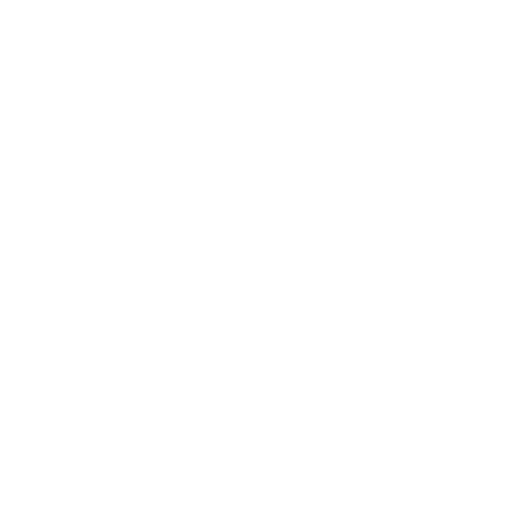 | [2fauth](./2fauth/) | Self-hosted web app to manage 2FA accounts and generate TOTP codes | 8000 |
| 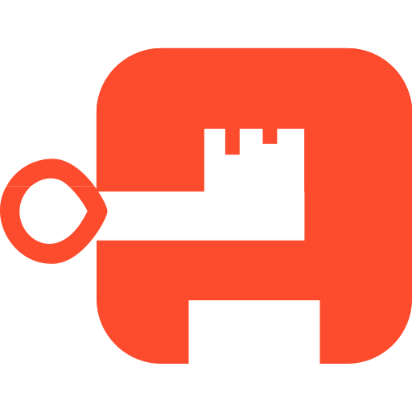 | [authentik](./authentik/) | Open-source Identity Provider supporting a wide set of protocols | 9000 |
| 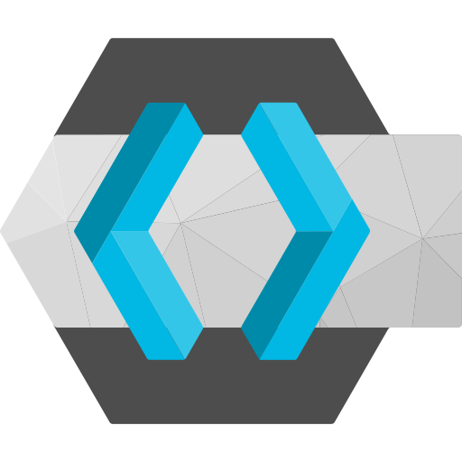 | [keycloak](./keycloak/) | Open Source Identity and Access Management | 8080 |

## 🐳 Infrastructure & Containers

| Logo | Project | Description | Port |
|------|---------|-------------|------|
|  | [arcane](./arcane/) | Modern Docker management dashboard with container monitoring and stack editor | 3000 |
| 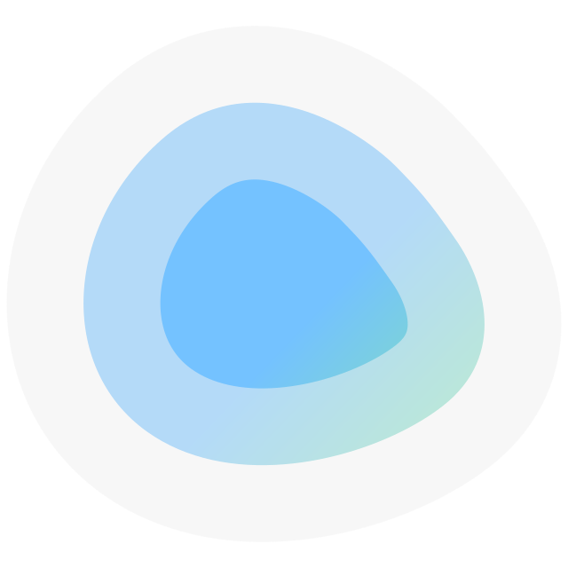 | [dockge](./dockge/) | Fancy, easy-to-use self-hosted docker compose stack manager | 5001 |
|  | [nuclio](./nuclio/) | High-performance serverless and real-time data processing platform with auto-scaling | 8070 |
| 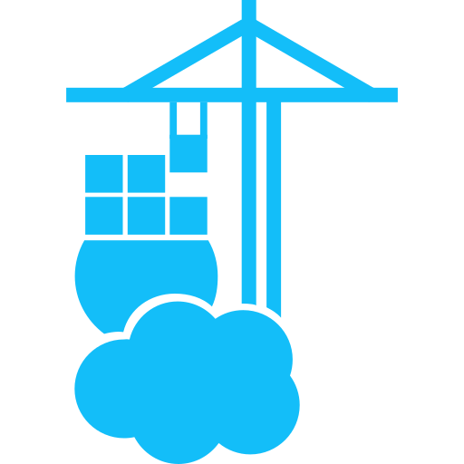 | [portainer](./portainer/) | Universal container management platform | 9443 |
|  | [rabbitmq](./rabbitmq/) | Message broker with management UI | 15672 |

## 📊 Monitoring & Analytics

| Logo | Project | Description | Port |
|------|---------|-------------|------|
| 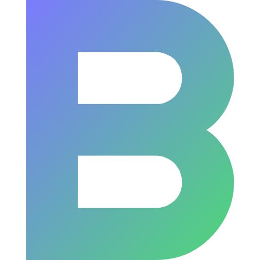 | [beszel](./beszel/) | Lightweight server monitoring hub with historical data and alerts | 8090 |
|  | [bytestash](./bytestash/) | Code snippet storage solution with search | 5000 |
|  | [changedetection](./changedetection/) | Best free open-source web page change detection and monitoring | 5000 |
|  | [checkmate](./checkmate/) | Server and website monitoring with status pages | 80 |
| 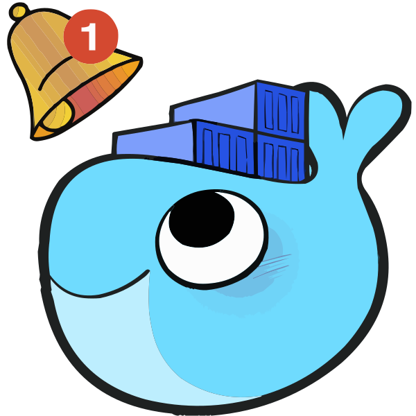 | [diun](./diun/) | Docker image update notifier with multiple notification channels | N/A |
|  | [dozzle](./dozzle/) | Realtime log viewer for Docker containers | 8080 |
|  | [enclosed](./enclosed/) | Minimal, privacy-first note and secret sharing | 8787 |
|  | [falco](./falco/) | Cloud-native runtime security tool for threat detection | 2802 |
| 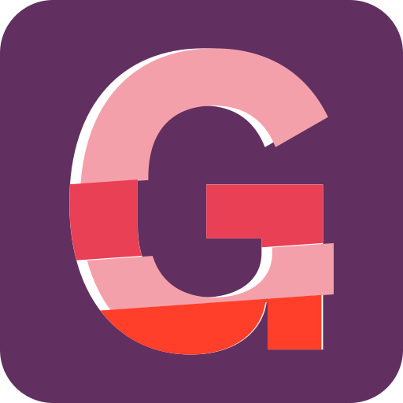 | [glitchtip](./glitchtip/) | Open-source error tracking compatible with Sentry SDK | 8000 |
|  | [grafana](./grafana/) | Open-source analytics and interactive visualization platform with dashboards, graphs, and alerts | 3000 |
|  | [healthchecks](./healthchecks/) | Self-hosted cron job and service monitoring with alert notifications | 8000 |
|  | [karakeep](./karakeep/) | Self-hosted bookmark-everything app with AI tagging | 3000 |
|  | [matomo](./matomo/) | Leading open-source web analytics platform with full data ownership | 80 |
|  | [mobsf](./mobsf/) | Automated mobile app security analysis framework | 8000 |
|  | [ntfy](./ntfy/) | Simple pub-sub notification service with HTTP API | 80 |
|  | [rybbit](./rybbit/) | Self-hosted link shortener and analytics | 3000 |
|  | [ryot](./ryot/) | Media tracker and review platform for movies, games, books, and more | 8000 |
|  | [sonarqube](./sonarqube/) | Code quality and security analysis platform | 9000 |
|  | [umami](./umami/) | Simple, fast, privacy-focused alternative to Google Analytics | 3000 |
| 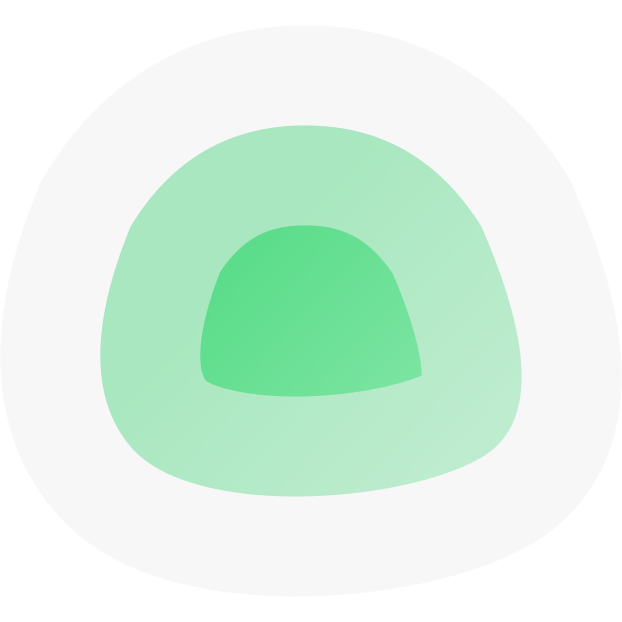 | [uptime-kuma](./uptime-kuma/) | Fancy self-hosted monitoring tool with status pages | 3001 |
| 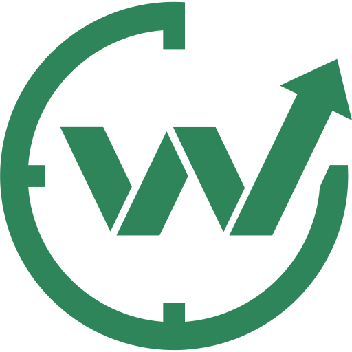 | [wakapi](./wakapi/) | Self-hosted coding time tracker with leaderboards | 3000 |
|  | [wapydev](./wapydev/) | Self-hosted web analytics platform with privacy-first tracking | 3000 |
|  | [web-check](./web-check/) | All-in-one website OSINT and security analysis tool | 3000 |

## 🔑 Password & Secrets

| Logo | Project | Description | Port |
|------|---------|-------------|------|
|  | [infisical](./infisical/) | Open-source secret management platform for teams and infrastructure | 8080 |
| 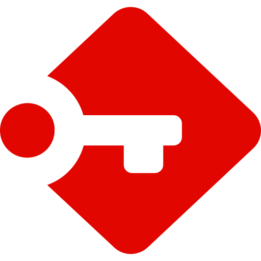 | [passbolt](./passbolt/) | Open-source password manager for teams | 443 |
|  | [privatebin](./privatebin/) | Minimalist, encrypted pastebin with client-side encryption | 80 |
|  | [vaultwarden](./vaultwarden/) | Lightweight Bitwarden-compatible password manager server written in Rust | 80 |

## 🏗️ Platforms

| Logo | Project | Description | Port |
|------|---------|-------------|------|
| 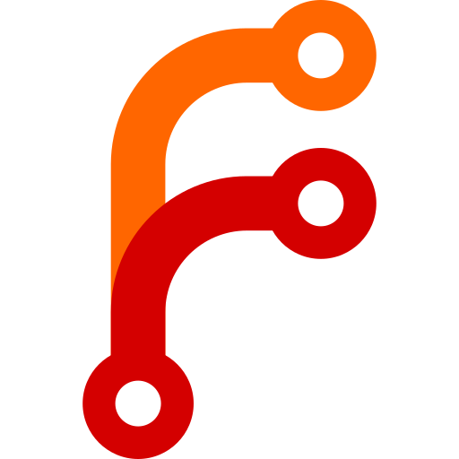 | [forgejo](./forgejo/) | Self-hosted Git service with intuitive interface and CI/CD | 3000 |
|  | [mattermost](./mattermost/) | Open-source Slack alternative for secure team communication | 8065 |
| 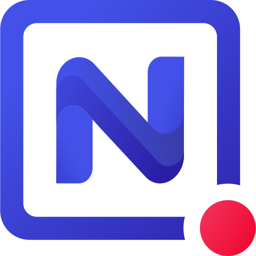 | [nocodb](./nocodb/) | Open-source Airtable alternative — turns any database into a smart spreadsheet | 8080 |
|  | [rocketchat](./rocketchat/) | Open-source team chat platform | 3000 |
| 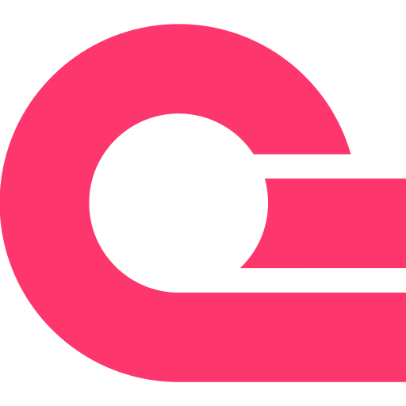 | [appwrite](./appwrite/) | Open-source Backend-as-a-Service with authentication, database, storage, functions, and realtime | 80 |
|  | [supabase](./supabase/) | Open-source Firebase alternative with Postgres, auth, and realtime | 8000 |

## 🛡️ Security

| Logo | Project | Description | Port |
|------|---------|-------------|------|
|  | [bugsink](./bugsink/) | Self-hosted error tracking and crash reporting | 8000 |
|  | [akto](./akto/) | Open-source API security testing platform with automated vulnerability detection and traffic analysis | 8080 |
| 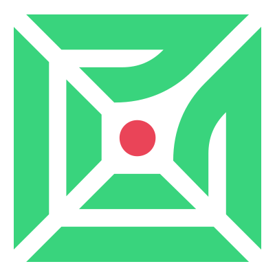 | [canarytokens](./canarytokens/) | Free canary tokens and honeypots for detecting unauthorized access and data breaches | 8083 |
| 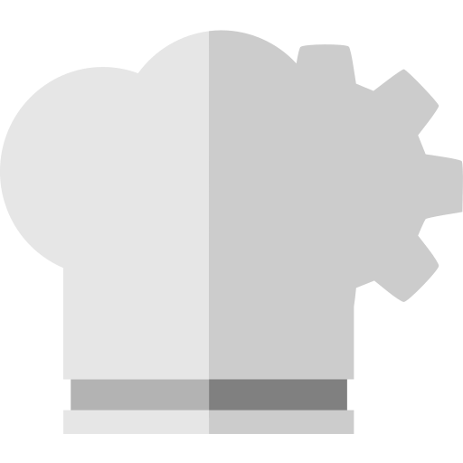 | [cyberchef](./cyberchef/) | Cyber Swiss Army Knife for encryption, encoding, and data analysis | 80 |
|  | [defectdojo](./defectdojo/) | Application vulnerability correlation and security orchestration platform | 8080 |
|  | [faraday](./faraday/) | Open Source Vulnerability Management Platform | 5985 |
|  | [ivre](./ivre/) | Network recon framework for passive and active intelligence gathering | 80 |

## 🗂️ Everything Else

| Logo | Project | Description | Port |
|------|---------|-------------|------|
|  | [apprise-api](./apprise-api/) | REST framework wrapping the Apprise notification library | 8000 |
|  | [browserless](./browserless/) | Deploy headless browsers in Docker | 3000 |
|  | [dashy](./dashy/) | Self-hostable personal dashboard with status-checking, widgets, and themes | 8080 |
| 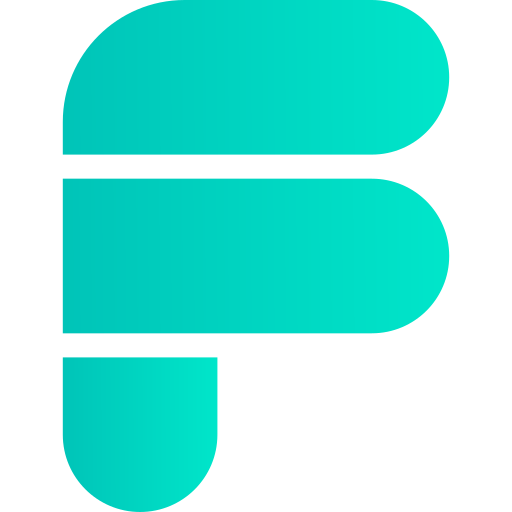 | [formbricks](./formbricks/) | Open-source survey and experience management platform | 3000 |
|  | [freshrss](./freshrss/) | Free, self-hostable news aggregator | 80 |
|  | [gotify](./gotify/) | Simple server for sending and receiving messages in real-time | 80 |
|  | [heyform](./heyform/) | Open-source form builder for conversational surveys, quizzes, and polls | 8000 |
|  | [kimai](./kimai/) | Web-based multi-user time-tracking application | 8001 |
|  | [octobox](./octobox/) | Self-hosted GitHub notification manager | 3000 |
| 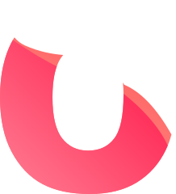 | [ontime](./ontime/) | Event timer and rundown management for live events | 4001 |
|  | [shlink](./shlink/) | Self-hosted URL shortener with analytics | 8080 |
|  | [soketi](./soketi/) | Simple, fast, and resilient WebSocket server | 6001 |
|  | [syncthing](./syncthing/) | Continuous file synchronization between devices | 8384 |
| 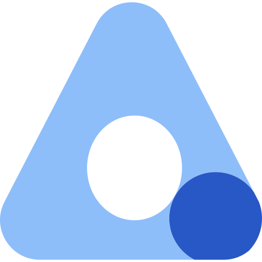 | [wallos](./wallos/) | Open-source subscription tracker to monitor and manage recurring payments | 80 |

---

## Usage

Each directory contains a Docker Compose file. To deploy a service:

```sh
cd <service-name>
docker compose up -d
```

Check for `.env` or `env.example` files and configure required variables before starting.

---

*151 self-hosted stacks 🚀*
